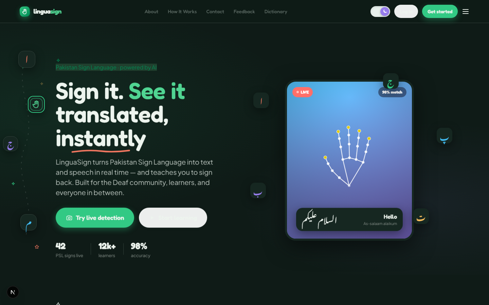
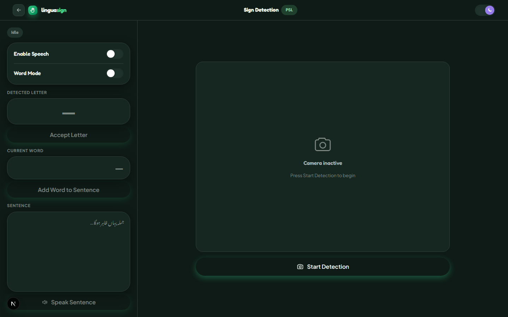
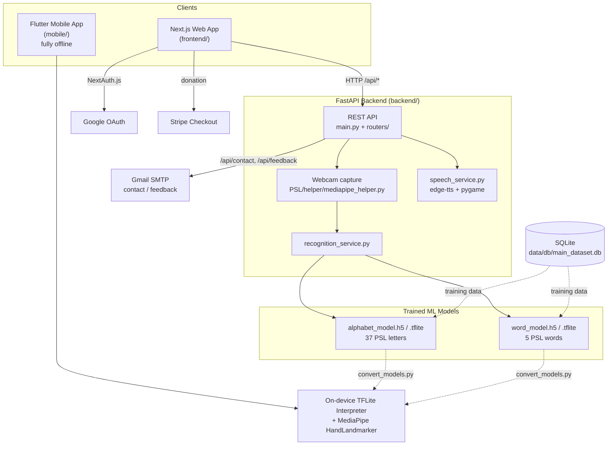
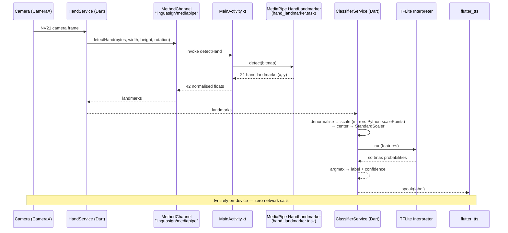
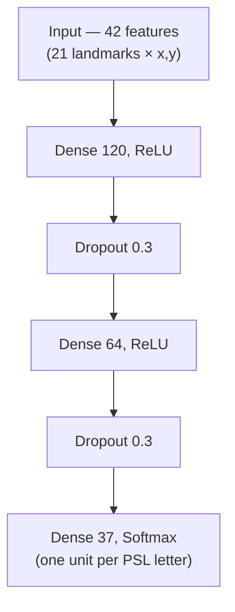
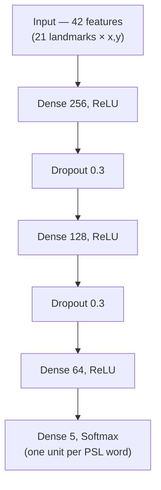
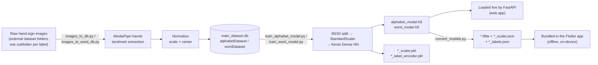
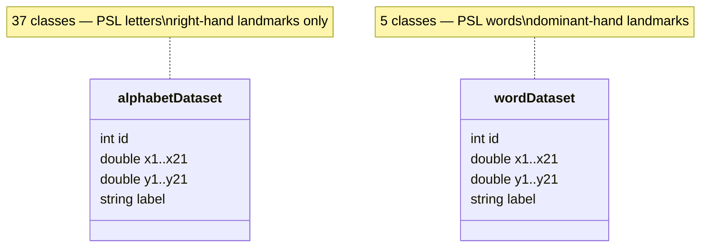
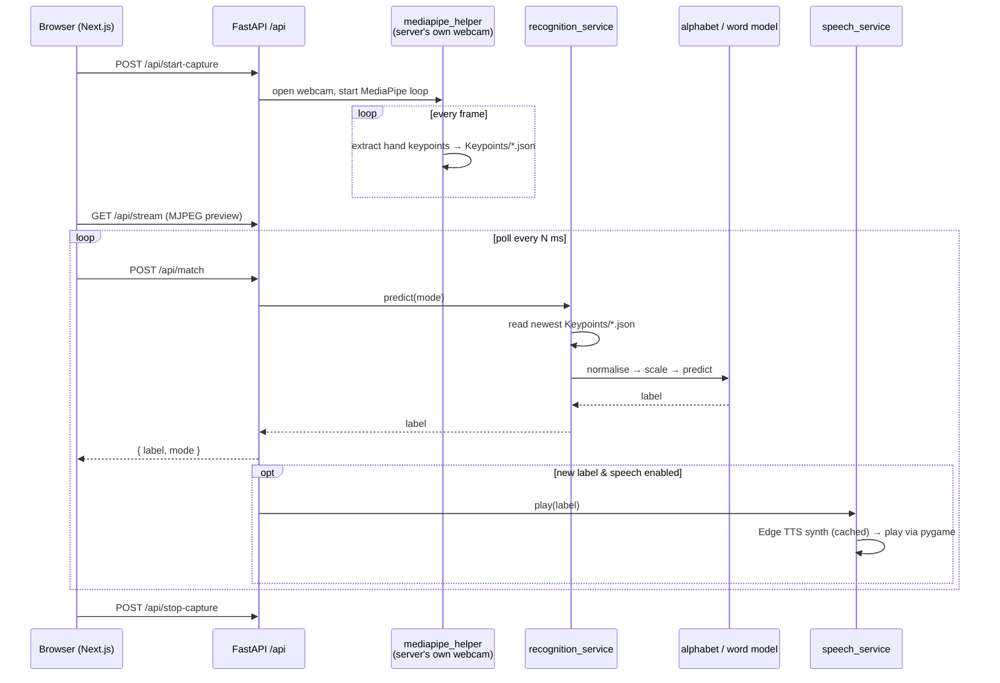

# LinguaSign — Pakistan Sign Language Detection System

A real-time Pakistani Sign Language (PSL) recognition system that translates hand gestures into Urdu text and speech, with a full learning platform built on top — available as a **web app**, and as a **fully offline, on-device Flutter mobile app**.

---

## Table of Contents

- [Application Overview](#application-overview)
- [System Architecture](#system-architecture)
- [Features](#features)
- [Mobile App](#mobile-app)
- [Tech Stack](#tech-stack)
- [Project Structure](#project-structure)
- [How the Model Works](#how-the-model-works)
- [Dataset & Training Pipeline](#dataset--training-pipeline)
- [Live Detection — How It Works](#live-detection--how-it-works)
- [Getting Started](#getting-started)
- [Training & Testing the Models](#training--testing-the-models)
- [How to Use](#how-to-use)
- [API Endpoints](#api-endpoints)
- [Architecture Notes](#architecture-notes)
- [License](#license)
- [Author](#author)

---

## Application Overview

### Landing Page



The landing page introduces LinguaSign to new visitors with a bold hero section — a full-bleed animated background with a live hand-skeleton preview demonstrating PSL detection in real time. The headline communicates the core value proposition immediately: *Sign it. See it translated, instantly.* Below the fold, trust indicators display the system's reach (users, detections, accuracy), followed by a feature highlights section and navigation links to the core platform modules. The top navigation provides direct access to all major sections — Detect, Learn, Contact, and Feedback — with a persistent theme toggle and a prominent **Try the Detector** call-to-action. The overall aesthetic uses a dark base with a green accent system, reflecting the PSL branding throughout.

---

### Sign Detector



The Sign Detector is the core feature of LinguaSign. Upon starting a session, the system opens the user's webcam via the FastAPI backend and begins streaming a live MJPEG feed. A MediaPipe-powered model analyses each frame in real time, extracting hand keypoints and passing them through a trained dense neural network to classify the current PSL hand sign. The detected letter is displayed immediately in the **Detected Letter** panel. Users can then:

- **Accept a letter** to append it to the active word being composed
- **Add a word to the sentence** once the full word is spelled out
- **Speak the sentence** to trigger Urdu audio playback for each word
- **Remove individual words** by clicking them in the sentence panel
- Switch to **Word Mode** for direct whole-word detection
- Adjust the **Detection Speed** slider (300 ms – 3 s cooldown) to balance responsiveness against false positives

The layout is split into a control panel on the left and the live camera feed on the right, keeping detection context and controls in the same view without context switching.

---

## System Architecture

LinguaSign is three cooperating pieces that all trace back to the **same trained models**: a Next.js web app, a FastAPI backend, and a standalone Flutter mobile app that carries its own copy of the models on-device.



**Key point:** the mobile app does **not** call the backend for recognition. `convert_models.py` exports the same trained Keras models to TFLite once; after that, the Flutter app runs camera → hand landmarks → classification → speech entirely on-device.

---

## Features

### Detection
- **Real-time recognition** — detects 37 PSL alphabet letters and 5 common words via webcam
- **Sentence builder** — accept letters → build words → compose full sentences
- **Urdu speech output** — synthesised Urdu audio (Edge TTS, `ur-PK-UzmaNeural` voice) for detected signs
- **Word mode** — switch between letter-by-letter and full-word detection
- **Adjustable speed** — tune detection cooldown from 300 ms to 3 seconds

### Learning Platform
- **Dashboard** — day streak tracker, weekly activity chart, signs-detected counter, recent history
- **Learn page** — browse all 37 PSL letters with hover-to-reveal sign images; quick quiz on PSL words
- **Live Learn** — real-time webcam practice with collapsible letter sidebar
- **Live Quiz** — timed quiz mode using the live camera
- **Dictionary** — searchable reference for all letters and words

### Account & Platform
- **Google Sign-In** — authentication via NextAuth.js
- **Donate** — Stripe-powered donation flow with a thank-you confirmation page
- **Contact & Feedback** — forms that email the team (Gmail SMTP) and persist submissions locally
- **About / How It Works / Help** — supporting informational pages
- **Settings** — user preferences

### UI / UX
- **Light & dark mode** — persisted theme toggle across all pages
- **Collapsible sidebar** — fold to icon-only view; hover the hand logo to reveal the expand button
- **Fully responsive** — mobile-optimised layouts at 860 px and 560 px breakpoints
- **Design system** — custom `ls-*` CSS classes, green accent, display font, Urdu font support

---

## Mobile App

`mobile/` is a complete, independent **Flutter** app (`linguasign_mobile`) that reimplements PSL detection to run **entirely offline, on-device** — no backend, no network call, no account required for detection.

### Screens

| Screen | Purpose |
|--------|---------|
| Onboarding | First-run walkthrough |
| Auth | Sign up / log in |
| Home | Entry point / navigation shell |
| Detect | Live camera-based PSL detection |
| Dictionary | Browse letters & words with reference images |
| Learn | Guided lessons |
| Quiz | Practice quiz mode |
| Profile | User settings & history |

### On-device pipeline



`ClassifierService` (`mobile/lib/services/classifier_service.dart`) deliberately **mirrors the exact Python preprocessing** used at training time (`removePoints` → `scalePoints` → `centerPoints` → `StandardScaler`), using the same scaler mean/scale values exported to JSON — so the on-device model behaves identically to the server-side one it was converted from.

### Mobile tech

| Package | Role |
|---------|------|
| `camera` | Live camera frames |
| `tflite_flutter` | Runs the converted `.tflite` models |
| MediaPipe Tasks (Kotlin, native) | On-device hand landmark detection |
| `flutter_tts` | On-device Urdu speech output |
| `provider`, `shared_preferences` | State & local persistence |

---

## Tech Stack

| Layer | Technology |
|-------|-----------|
| Web Frontend | Next.js 16 (App Router), TypeScript, React 19 |
| Styling | Custom CSS design system (`globals.css`) |
| Auth | NextAuth.js (Google OAuth) |
| Payments | Stripe |
| Backend | FastAPI, Python 3.9+ |
| ML / CV (training + server) | MediaPipe, TensorFlow / Keras, scikit-learn, OpenCV |
| Speech (server) | Edge TTS (`ur-PK-UzmaNeural`), cached & played via `pygame` |
| Mobile | Flutter (Dart), TensorFlow Lite, MediaPipe HandLandmarker (Kotlin/Android native) |

---

## Project Structure

```
├── backend/
│   ├── main.py                        # FastAPI entry point
│   ├── routers/                       # capture, recognition, speech, stream, contact
│   ├── services/                      # recognition_service, speech_service, mediapipe_service
│   ├── core/config.py                 # Settings (reads backend/.env)
│   ├── PSL/
│   │   ├── alphabet_recognition/      # train_alphabet_model.py, alphabet_recognition.py
│   │   ├── word_recognition/          # train_word_model.py, word_recognition.py
│   │   ├── helper/                    # mediapipe_helper, scale, move, normalize, db_helper...
│   │   └── retrain.py                 # legacy one-shot retrain helper
│   ├── images_to_db.py                # raw alphabet images → keypoints → SQLite
│   ├── images_to_word_db.py           # raw word images → keypoints → SQLite
│   ├── convert_models.py              # .h5 + .pkl → .tflite + .json (feeds the mobile app)
│   ├── data/
│   │   ├── db/main_dataset.db         # SQLite: alphabetDataset / wordDataset tables
│   │   ├── models/                    # Trained models (.h5, .pkl scaler/encoder)
│   │   └── tts_cache/                 # Cached Urdu speech audio
│   ├── Keypoints/                     # Live-captured keypoint JSON (runtime)
│   └── requirements.txt
│
├── frontend/
│   └── app/
│       ├── page.tsx                   # Landing / home page
│       ├── sign/                      # Live detection page
│       ├── dashboard/                 # Progress dashboard
│       ├── learn/ live-learn/ live-quiz/ dictionary/   # Learning platform
│       ├── auth/                      # Google sign-in
│       ├── donate/                    # Stripe donation flow
│       ├── contact/ feedback/ about/ how-it-works/ help/ settings/
│       ├── api/auth/ api/donate/      # NextAuth + Stripe route handlers
│       └── components/ls/             # AppShell, Sidebar, TopBar, Icons
│
└── mobile/                            # Flutter app — offline, on-device PSL recognition
    ├── lib/
    │   ├── main.dart
    │   ├── screens/                   # onboarding, auth, home, detect, learn, quiz, dictionary, profile
    │   ├── services/                  # classifier_service, hand_service, tts_service, history_service
    │   └── widgets/
    ├── assets/
    │   ├── models/                    # alphabet/word .tflite + scaler/labels .json + hand_landmarker.task
    │   └── images/                    # alphabet/, words/ reference images
    └── android/                       # Native Kotlin MediaPipe HandLandmarker bridge
```

---

## How the Model Works

Two separate models are trained and served — one for alphabet letters, one for words. Both share the same input pipeline and overall architecture shape.

### Input pipeline

MediaPipe Hands extracts 21 hand landmarks per frame, each carrying `[x, y, confidence]`. Confidence scores are discarded, leaving **42 features per frame** (21 landmarks × XY pixel coordinates). The landmarks are then:

1. **Scaled** relative to the wrist→middle-finger-MCP distance, so hand size/distance-from-camera doesn't affect the result
2. **Centered** so the wrist sits at a fixed reference point
3. **Standardised** with a `StandardScaler` (fit on the training set) before being passed to the model

### Alphabet model — 37 classes



| Layer | Units | Activation |
|-------|-------|-----------|
| Dense | 120 | ReLU |
| Dropout | 0.3 | — |
| Dense | 64 | ReLU |
| Dropout | 0.3 | — |
| Dense (output) | 37 | Softmax |

- Optimizer: Adam · Loss: Categorical cross-entropy
- Train/test split: 80 / 20 · Epochs: 25 · Batch size: 1

### Word model — 5 classes



| Layer | Units | Activation |
|-------|-------|-----------|
| Dense | 256 | ReLU |
| Dropout | 0.3 | — |
| Dense | 128 | ReLU |
| Dropout | 0.3 | — |
| Dense | 64 | ReLU |
| Dense (output) | 5 | Softmax |

- Optimizer: Adam · Loss: Categorical cross-entropy
- Train/test split: 80 / 20, stratified · Epochs: 50 · Batch size: 32

Training prints test-set accuracy and saves a normalized confusion matrix (`data/models/confusion_matrix.png`) for the alphabet model — used iteratively to identify and correct misclassified letter pairs.

### From trained model to mobile model

`convert_models.py` takes the exact same `.h5` model + `StandardScaler` + `LabelEncoder` used by the backend and exports them to formats Flutter can load natively — **no retraining, no architecture change**, just a format conversion:

| Backend artifact | Mobile artifact | Via |
|---|---|---|
| `alphabet_model.h5` / `word_model.h5` | `*.tflite` | `tf.lite.TFLiteConverter` (float16 quantised) |
| `*_scaler.pkl` (mean/scale) | `*_scaler.json` | plain JSON dump |
| `*_label_encoder.pkl` (classes) | `*_labels.json` | plain JSON dump |

---

## Dataset & Training Pipeline



### Dataset schema

Keypoints (not raw images) are what's actually stored — each row is one hand pose, already reduced to 42 numeric features plus a label:



Both tables live in `backend/data/db/main_dataset.db`. The raw source images are **not** part of this repo (they're large, external datasets referenced by absolute paths in `images_to_db.py` / `images_to_word_db.py` / `extract_dataset_images.py` / `extract_word_images.py`) — only the extracted, privacy-safe keypoint features are committed.

---

## Live Detection — How It Works

### Web (backend-driven)



### Mobile (on-device)

See [Mobile App → On-device pipeline](#mobile-app) above — same preprocessing math, but the whole chain runs locally with no server involved.

---

## Getting Started

### Prerequisites

- Python 3.9+
- Node.js 18+
- A webcam (for the web detector)
- Flutter SDK 3.3+ and Android Studio / an Android device or emulator (only if you want to build the mobile app)

### 1. Clone the repository

```bash
git clone https://github.com/abdul-wahid-lab/fyp-project-Pakistan-sign-language-detection-system.git
cd fyp-project-Pakistan-sign-language-detection-system
```

### 2. Set up the backend

```bash
cd backend
```

Create and activate a virtual environment:

```bash
# Windows
python -m venv venv
venv\Scripts\activate

# macOS / Linux
python -m venv venv
source venv/bin/activate
```

Install dependencies:

```bash
pip install -r requirements.txt
```

Create a `.env` file in `backend/` (this file is gitignored — these are the actual settings read by `core/config.py`; model file paths themselves are hardcoded in the recognition modules, not configured via env):

```env
FRONTEND_URL=http://localhost:3000
KEYPOINTS_DIR=Keypoints
DATA_DIR=PSL/data
SPEECH_DIR=data/speech
CAMERA_INDEX=0

SMTP_HOST=smtp.gmail.com
SMTP_PORT=587
SMTP_USER=your-gmail-address@gmail.com
SMTP_PASS=your-gmail-app-password
CONTACT_TO=your-gmail-address@gmail.com
```

Start the backend:

```bash
uvicorn main:app --reload --host 127.0.0.1 --port 8000
```

### 3. Set up the frontend

```bash
cd frontend
npm install
```

Create a `.env.local` file in `frontend/` (gitignored — required for Google sign-in and the donation page):

```env
AUTH_SECRET=generate-one-with-npx-auth-secret
AUTH_GOOGLE_ID=your-google-oauth-client-id
AUTH_GOOGLE_SECRET=your-google-oauth-client-secret

STRIPE_SECRET_KEY=sk_test_xxx
NEXT_PUBLIC_STRIPE_PUBLISHABLE_KEY=pk_test_xxx
```

> Create the Google OAuth client at [console.cloud.google.com](https://console.cloud.google.com/) → APIs & Services → Credentials, with authorized redirect URI `http://localhost:3000/api/auth/callback/google`.

```bash
npm run dev
```

### 4. Open the app

Visit [http://localhost:3000](http://localhost:3000)

### 5. (Optional) Run the mobile app

The on-device models are already bundled under `mobile/assets/models/` — the mobile app does **not** need the backend running.

```bash
cd mobile
flutter pub get
flutter run
```

---

## Training & Testing the Models

Run from `backend/` with the virtual environment active. This is the pipeline that actually produced the shipped models (not the older `eel`/OpenPose GUI tools under `PSL/`, which need packages not in `requirements.txt` and aren't part of the running app).

**Step 1 — Extract keypoints from raw images into SQLite:**

```bash
python images_to_db.py --dataset "<path-to-alphabet-images>" --clear
python images_to_word_db.py "<path-to-word-images>" --clear
```

**Step 2 — Train (this is also the "testing" step — it prints test-set accuracy and saves a confusion matrix):**

```bash
python -m PSL.alphabet_recognition.train_alphabet_model
python -m PSL.word_recognition.train_word_model
```

**Step 3 (optional) — Convert to TFLite for the mobile app:**

```bash
python convert_models.py
# then copy the 6 output files into mobile/assets/models/
```

**Step 4 (optional) — Refresh UI reference images:**

```bash
python extract_dataset_images.py
python extract_word_images.py
```

---

## How to Use

1. Open the app and navigate to **Sign Detector** from the sidebar
2. Click **Start Detection** and allow camera access
3. Make a PSL hand sign in front of your webcam
4. The detected letter appears in the **Detected Letter** panel
5. Click **Accept Letter** to add it to your current word
6. Click **Add Word to Sentence** when a word is complete
7. Use **Speak Sentence** to hear the output in Urdu
8. Adjust the **Detection Speed** slider as needed

To learn PSL signs, visit the **Learn** page — hover any letter card to see its hand sign image, or take the quick quiz on common words.

On **mobile**, open the app, grant camera permission, and go to the Detect tab — recognition works offline, with no sign-in required.

### Tips

- Use good lighting for best accuracy
- Keep your hand centered in the camera frame
- Enable **Word Mode** to detect full words directly
- Toggle **Enable Speech** to automatically speak each word as it's added

---

## API Endpoints

| Method | Endpoint | Description |
|--------|----------|-------------|
| `POST` | `/api/start-capture` | Open the server's webcam and begin frame capture |
| `POST` | `/api/stop-capture` | Release the webcam |
| `POST` | `/api/match` | Run detection on the latest captured frame, return `{ label, mode }` |
| `GET` | `/api/stream` | MJPEG live video stream |
| `POST` | `/api/speech/{label}` | Synthesise (Edge TTS, cached) and play Urdu audio for a label |
| `POST` | `/api/speech/preload/{label}` | Pre-generate and cache audio for a label without playing it |
| `POST` | `/api/log-missing` | Log a word with no audio mapping, for follow-up |
| `POST` | `/api/contact` | Submit the contact form (emails + persists locally) |
| `POST` | `/api/feedback` | Submit the feedback form (emails + persists locally) |

---

## Architecture Notes

Worth knowing if you're extending or deploying this project:

- **The webcam is opened on the server, not the browser.** `/api/start-capture` calls `cv2.VideoCapture(camera_index)` on whatever machine runs the FastAPI backend. This works great when backend + frontend run on the same computer (the intended local/dev setup) but means the web app cannot be deployed as-is to a remote host and used from a different device's camera.
- **Speech plays on the server's own speakers**, via `pygame.mixer` — it is not streamed to the browser as an audio file.
- **The mobile app has neither limitation** — camera access and speech both happen on the phone itself, which is why it was built as a fully offline alternative.

---

## License

This project is licensed under the [MIT License](LICENSE).

Copyright (c) 2026 Abdul Wahid

---

## Author

**Abdul Wahid** — [abdul-wahid-lab](https://github.com/abdul-wahid-lab)
